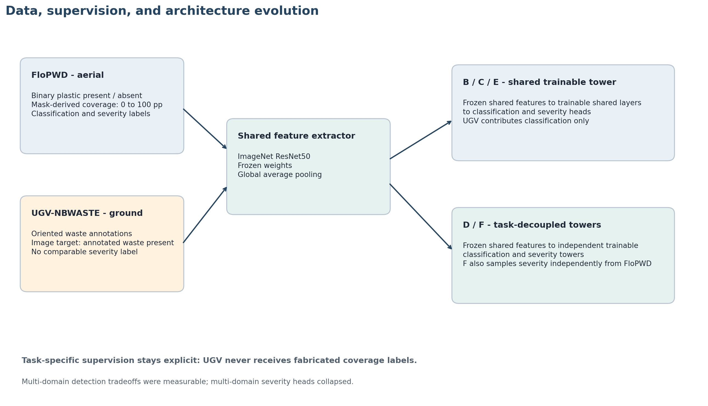

# Floating Plastic Detection & Severity Estimation

This project evaluates aerial floating-plastic detection and image-area coverage estimation, then tests whether ground-level waste imagery can improve cross-domain detection. It is a deterministic rebuild and extension of a dissertation project, with separate labels, grouped splits, matched optimizer budgets, and explicit reporting of where multi-domain severity regression failed.

## Why this project matters

Repeatable image-based monitoring can help environmental teams survey floating waste across lakes and waterways. This project studies what a vision model can measure from images, and how its behavior changes when it is trained across different viewpoints and label systems.

## Key reproduced results

**Control A — FloPWD-only:** 96.00% accuracy, 96.05% balanced accuracy, 95.95% sensitivity, 96.15% specificity, and 2.17 percentage-point (pp) severity MAE on the frozen 300-image test split.

**Model C — balanced multi-domain:** 97.44% FloPWD specificity and 99.81% UGV annotated-waste positive recall. These are different target tasks: UGV has positive-only annotated-waste examples and does not provide clean-water negatives.

Multi-domain Models B through F produced near-zero or near-constant severity outputs. Task decoupling (D) and restoring the original FloPWD severity sampling distribution (F) did not resolve the collapse. This is a central diagnostic finding, not a successful severity result. The sigmoid-times-100 output's optimization dynamics remain a plausible unresolved mechanism, not a proven cause.

| Model | Design | FloPWD accuracy | Balanced accuracy | Sensitivity | Specificity | Precision | F1 | Severity MAE (all / positive, pp) | UGV annotated-waste positive recall |
|---|---|---:|---:|---:|---:|---:|---:|---:|---:|
| A | FloPWD control, original prior | 96.00% | 96.05% | 95.95% | 96.15% | 98.61% | 97.26% | 2.17 / 2.92 | 95.15% |
| B | Multi-domain, original FloPWD prior | 92.33% | 88.17% | 96.85% | 79.49% | 93.07% | 94.92% | 5.48 / 7.40 | 100.00% |
| C | Multi-domain, 1:1 FloPWD prior | 93.33% | 94.66% | 91.89% | 97.44% | 99.03% | 95.33% | 5.47 / 7.39 | 99.81% |
| D | C protocol, task-decoupled towers | 92.00% | 91.68% | 92.34% | 91.03% | 96.70% | 94.47% | 5.48 / 7.40 | 100.00% |
| E | Multi-domain, 2:1 FloPWD prior | 90.00% | 92.00% | 87.84% | 96.15% | 98.48% | 92.86% | 5.48 / 7.40 | 100.00% |
| F | D architecture, original-prior severity stream | 93.33% | 91.75% | 95.05% | 88.46% | 95.91% | 95.48% | 5.48 / 7.40 | 100.00% |

FloPWD metrics are binary plastic-presence metrics. UGV reports only recall among annotated-waste-positive records. Full machine-readable values and provenance are in [`experiments/results/`](experiments/results/); methods and interpretations are in [`docs/results.md`](docs/results.md).

## System overview

An ImageNet-initialized ResNet50 extracts image features. The model predicts FloPWD binary plastic presence and continuous image-area coverage. B/C/E use a shared trainable multi-task tower; D/F retain the frozen shared feature extractor but split the trainable classification and severity towers. The architecture and label flow are summarized in [the diagram](assets/architecture_overview.png).



## Datasets

- **FloPWD:** aerial imagery with binary plastic-presence labels and mask-derived image coverage percentages.
- **UGV-NBWASTE:** ground-level images with oriented non-biodegradable-waste annotations. The supported image-level target is annotated waste present; it is not equivalent to FloPWD plastic presence for every class. UGV has no comparable severity label.

The datasets are heterogeneous in viewpoint, setting, and label semantics. They are not merged into a claim of identical targets. Source data is not included; see [`data/README.md`](data/README.md) for attribution, licence, export-version notes, and local layout.

## Experiment design

| Model | Training design | Main question |
|---|---|---|
| A | FloPWD only; original class prior | Control baseline for detection and severity |
| B | FloPWD + UGV; 0.5/0.5 domain sampling; original FloPWD prior | Effect of adding a positive-only second domain |
| C | Same as B; 1:1 negative:positive FloPWD sampling | Effect of classification class-prior balancing |
| D | Same data protocol as C; task-specific trainable towers | Effect of task-head decoupling |
| E | Same shared-tower protocol as C; 2:1 negative:positive FloPWD sampling | Sensitivity/specificity tradeoff at a second prior |
| F | Same architecture and classification stream as D; independent original-prior FloPWD severity stream | Effect of restoring the severity-target sampling distribution |

The controlled multi-domain runs use seed 42, frozen ImageNet ResNet50, Adam at 0.001, batch size 32, 15 epochs, and 660 optimizer updates. F adds a severity-only forward pass, so its image-forward/FLOP cost is higher than D despite matched optimizer updates and severity-example count. The tracked experiment matrix marks every experiment completed. **Experimental phase closed after Model F.**

## Main findings

- Control A achieved strong FloPWD classification and severity performance.
- Adding UGV increased UGV annotated-waste positive recall but reduced FloPWD specificity in B.
- C's 1:1 FloPWD class balancing recovered specificity and balanced accuracy.
- E's 2:1 balance reduced sensitivity and did not improve specificity beyond C.
- Multi-domain severity outputs collapsed. D showed that task decoupling alone was insufficient.
- F restored the original severity-target sampling distribution without restoring severity performance.
- The sigmoid-times-100 output and its optimization dynamics remain a plausible unresolved factor. The experiment does not prove causality.

Model A is the strongest overall FloPWD classification-and-severity baseline. Model C is the strongest multi-domain specificity/balanced operating point. Model F is the final diagnostic ablation, not a recommended severity model. There is no single winner across distinct tasks.

## Reproducibility

The controlled experiments use seed 42, committed FloPWD and grouped UGV split manifests, Keras ResNet50 preprocessing, and matched optimizer-update budgets. The UGV manifest groups filename variants so detected source-like groups do not cross partitions; this is a leakage-control proxy rather than proof of image identity. Result JSONs retain training/evaluation Git SHAs where available, model/evaluation hashes, and split/specification hashes. Run checkpoints and full prediction tables are intentionally excluded from Git.

### Environment and commands

The validated benchmark runtime was Python 3.10.11, TensorFlow 2.15.1, Keras 2.15.0, and NumPy 1.26.4. Install dependencies in a virtual environment:

```powershell
python -m venv .venv
.\.venv\Scripts\Activate.ps1
python -m pip install -r requirements.txt -r requirements-dev.txt
```

Inspect dataset metadata and regenerate deterministic manifests if needed:

```powershell
python scripts/inspect_data.py --dataset flopwd --path "<PATH_TO_FLOPWD>" --seed 42 --write-split-manifest
python scripts/inspect_data.py --dataset ugv --path "<PATH_TO_UGV>" --seed 42 --write-grouped-split --write-leakage-report
```

The frozen portfolio manifests are already tracked. The following commands show the training interfaces; choose a new output directory for any deliberate reproduction. The experimental matrix is closed and its specifications should remain unchanged.

```powershell
# Control A
python scripts/train.py --data-dir "<PATH_TO_FLOPWD>" --config configs/default.yaml --split-manifest experiments/splits/flopwd_seed42.json --output-dir runs/reproduction_a

# Multi-domain B (original FloPWD prior)
python scripts/train_multidomain.py --data-dir "<PATH_TO_FLOPWD>" --ugv-dir "<PATH_TO_UGV>" --spec experiments/specs/multidomain_matrix_seed42.yaml --experiment-type multidomain --output-dir runs/reproduction_b

# Multi-domain C (1:1 FloPWD classification balance)
python scripts/train_multidomain.py --data-dir "<PATH_TO_FLOPWD>" --ugv-dir "<PATH_TO_UGV>" --spec experiments/specs/multidomain_matrix_seed42.yaml --experiment-type multidomain_class_balanced --flopwd-negative-to-positive 1 --output-dir runs/reproduction_c

# Evaluate an available FloPWD checkpoint on the frozen FloPWD test partition
python scripts/evaluate.py --data-dir "<PATH_TO_FLOPWD>" --model runs/reproduction_a/model.keras --split-manifest experiments/splits/flopwd_seed42.json --output-dir runs/reproduction_a/evaluation

# Predict one image with validated Control A severity capability
python scripts/predict.py --model runs/flopwd_original_seed42/model.keras --model-id A --domain flopwd --image "<PATH_TO_IMAGE>"

# Run the test suite
python -m compileall src scripts tests
python -m pytest -v
```

Full multi-domain evaluation also requires the UGV local export and its grouped manifest. UGV evaluation should report UGV annotated-waste positive recall and probability summaries only. Never derive specificity or balanced accuracy from this positive-only test population.

## Limitations

- UGV has no clean negatives, so it cannot support specificity, balanced accuracy, or binary accuracy.
- UGV annotated-waste positives are broader than FloPWD plastic-presence labels and are not a matched semantic target.
- Filename grouping is a practical leakage-control proxy, not proof of original-image identity; differently named duplicates may remain.
- The full benchmarks were CPU-only and use one seed for the main controlled comparison.
- Severity collapsed in all multi-domain configurations B through F; those severity outputs are not for use.
- Results cover one frozen split and do not establish geographic, seasonal, or operational generalization.

## Historical dissertation vs. rebuilt portfolio

The dissertation's historical values are reported separately in [`docs/results.md`](docs/results.md). This repository is a deterministic rebuild and extension using new seed-42 splits, official ResNet preprocessing, stricter metric semantics, grouped UGV leakage controls, partial supervision, and controlled optimizer-update budgets. Historical 100% figures are not reproduced results from this portfolio.

## Repository map

- `src/floating_plastic/` — model, data contracts, splits, losses, samplers, and metrics.
- `scripts/` — training, evaluation, prediction, and dataset inspection.
- `experiments/specs/` — frozen experiment configurations and final status.
- `experiments/results/` — compact tracked result summaries and provenance.
- `assets/` — recruiter-facing comparison and architecture figures.
- `docs/` — methodology, results, model card, and reproducibility.
- `legacy/` — historical appendix code retained for provenance.

## License

Source code is licensed under MIT. Dataset and pretrained-weight terms remain with their providers; datasets and checkpoints are not redistributed here. Datasets are not covered by this licence. They remain subject to their
respective licences and are not redistributed by this repository.

