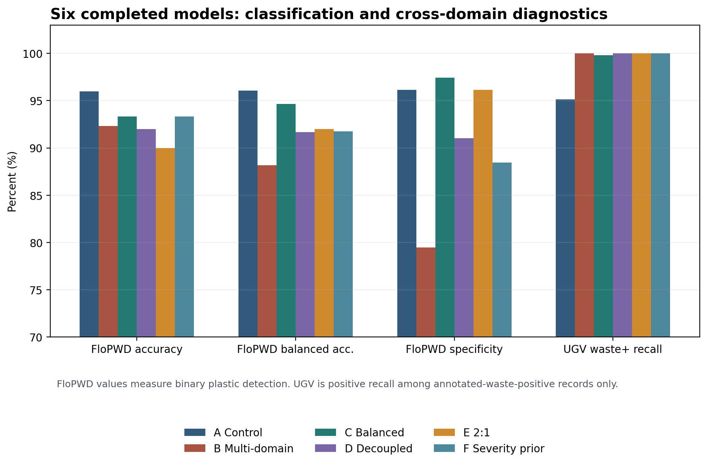
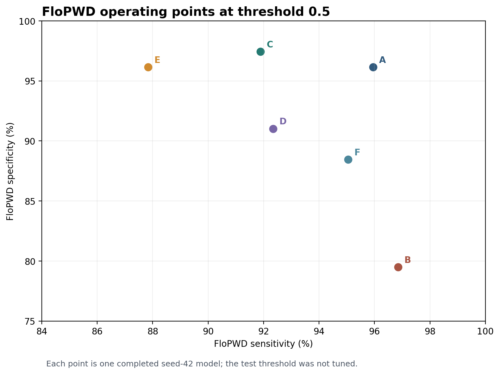
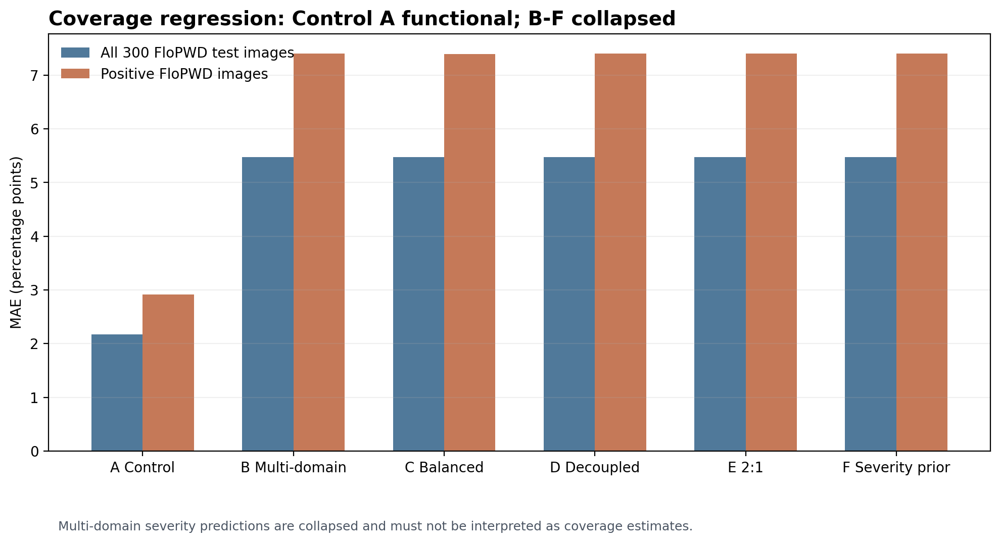
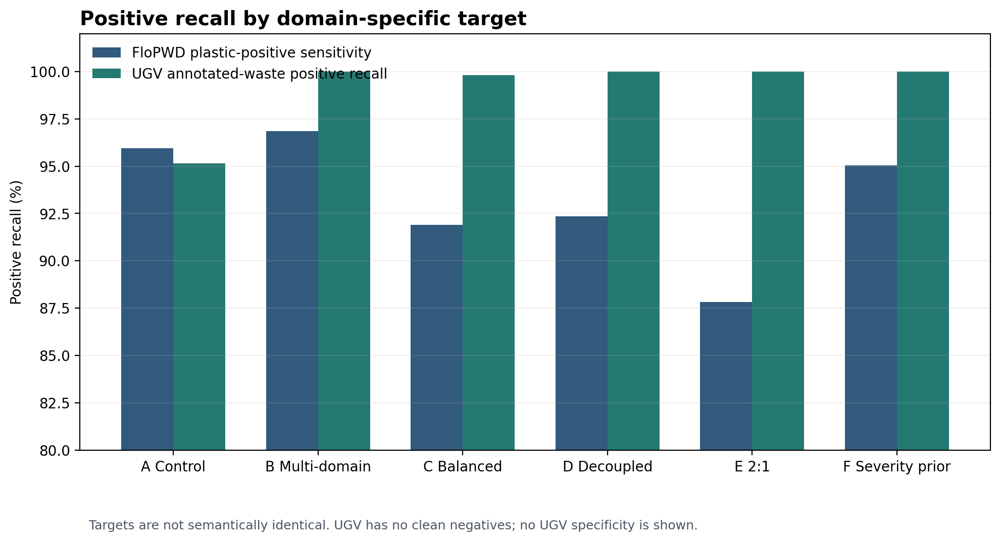

# Results

## Scope and semantics

The table below contains reproduced results from the completed seed-42 portfolio runs. Classification results are evaluated on the frozen 300-image FloPWD test split. Severity errors are percentage points (pp). UGV values are **annotated-waste positive recall** on 536 grouped positive records; UGV has no clean negatives, so specificity, balanced accuracy, and binary accuracy are unsupported.

| Model | FloPWD accuracy | Balanced accuracy | Sensitivity | Specificity | Precision | F1 | Severity MAE all (pp) | Severity MAE positive (pp) | UGV annotated-waste positive recall |
|---|---:|---:|---:|---:|---:|---:|---:|---:|---:|
| A | 96.00% | 96.05% | 95.95% | 96.15% | 98.61% | 97.26% | 2.170 | 2.916 | 95.15% |
| B | 92.33% | 88.17% | 96.85% | 79.49% | 93.07% | 94.92% | 5.479 | 7.404 | 100.00% |
| C | 93.33% | 94.66% | 91.89% | 97.44% | 99.03% | 95.33% | 5.472 | 7.394 | 99.81% |
| D | 92.00% | 91.68% | 92.34% | 91.03% | 96.70% | 94.47% | 5.479 | 7.404 | 100.00% |
| E | 90.00% | 92.00% | 87.84% | 96.15% | 98.48% | 92.86% | 5.479 | 7.404 | 100.00% |
| F | 93.33% | 91.75% | 95.05% | 88.46% | 95.91% | 95.48% | 5.479 | 7.404 | 100.00% |

Full precision, confusion counts, run configuration, hashes, and known training/evaluation Git SHAs are stored in [`../experiments/results/`](../experiments/results/). The package excludes checkpoints, run directories, raw prediction tables, and source datasets.

## Interpretation

1. Control A is the strongest overall FloPWD baseline across binary detection and severity estimation.
2. B's original-prior multi-domain training raised UGV annotated-waste positive recall from 95.15% to 100%, while FloPWD specificity fell from 96.15% to 79.49%.
3. C's 1:1 FloPWD classification balance recovered FloPWD specificity to 97.44% and balanced accuracy to 94.66%, with 99.81% UGV annotated-waste positive recall.
4. E's 2:1 negative:positive FloPWD balance reduced sensitivity to 87.84% and did not improve specificity beyond C.
5. B/C/E severity outputs collapsed near zero. D's task-decoupled trainable towers isolated task-specific gradients but did not restore severity.
6. F restored the original unbalanced FloPWD severity-target sampling distribution while matching D's optimizer updates and severity-example count; severity remained near-zero collapsed.

The evidence shows that classification prior changes the sensitivity/specificity operating tradeoff. It does not establish a sole cause for the regression collapse. After D and F, the sigmoid×100 output's optimization dynamics remain a plausible unresolved mechanism, not a proven explanation.

## Portfolio model roles

- **A:** validated severity model and best overall FloPWD classification/severity baseline.
- **C:** strongest multi-domain FloPWD specificity and balanced-accuracy operating point.
- **F:** final diagnostic ablation showing that restoring the severity sampling prior alone did not recover severity. F is not a production severity model.

These roles reflect different tasks; they do not define one universal winning model.

## Historical dissertation results (not reproduced)

The dissertation materials reported the following historical values. They are included as context only and are not results from the rebuilt pipeline.

| Historical report metric | Reported value |
|---|---:|
| Baseline validation accuracy | 74.3% |
| Baseline specificity | 0% |
| 1:1 balancing specificity | 44% |
| Final reported specificity | 100% |
| Final reported sensitivity | 100% |
| Severity MAE | 5.3 pp |
| Mean classification confidence | 93% |

These historical figures used different code, data handling, and metric semantics. In particular, historical 100% values are not reproduced results from this portfolio. The rebuild uses deterministic seed-42 splits, official Keras ResNet preprocessing, grouped UGV partitions, positive-only UGV metric semantics, and controlled optimizer-update budgets. See [`methodology.md`](methodology.md) and [`reproducibility.md`](reproducibility.md).

## Why collapsed severity can still have a finite MAE

Models B–F predict values near zero or a near-constant value, so their severity heads are not useful estimators despite their finite MAE. In the 300-image FloPWD test set, 79 targets are exactly zero, the median is 0.825 pp, 162 targets are below 1 pp, and the maximum is 78.31 pp. A near-zero predictor therefore obtains an all-image MAE around 5.48 pp, close to the test target mean of 5.479 pp, while missing high-coverage examples by as much as about 78 pp. The positive-only severity MAE around 7.40 pp also shows the collapse. These scores must not be read as functional regression performance.

## Figures

